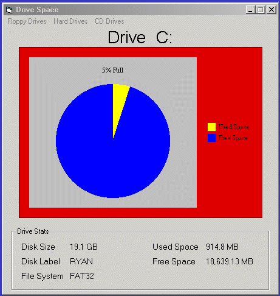



## Drive Space 2\.0

### Description

Finds all the drives on a system, tells if media is in the drive or not and finds the filesystem,size,label,used space,and free space of the drive.
 
### More Info
 

             |
---                |---
**Submitted On**   |2000-11-22 00:48:02
**By**             |[Ryan](https://github.com/Planet-Source-Code/PSCIndex/blob/master/ByAuthor/ryan.md)
**Level**          |Intermediate
**User Rating**    |5.0 (30 globes from 6 users)
**Compatibility**  |VB 4\.0 \(32\-bit\), VB 5\.0, VB 6\.0
**Category**       |[Complete Applications](https://github.com/Planet-Source-Code/PSCIndex/blob/master/ByCategory/complete-applications__1-27.md)
**World**          |[Visual Basic](https://github.com/Planet-Source-Code/PSCIndex/blob/master/ByWorld/visual-basic.md)
**Archive File**   |[CODE\_UPLOAD1192411222000\.zip](https://github.com/Planet-Source-Code/ryan-drive-space-2-0__1-13011/archive/master.zip)

### API Declarations

in zip

